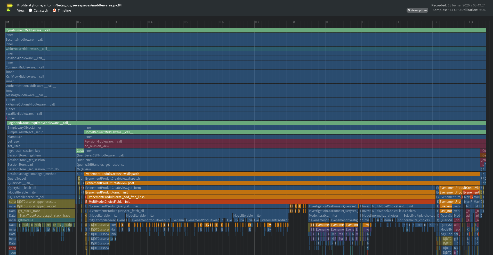
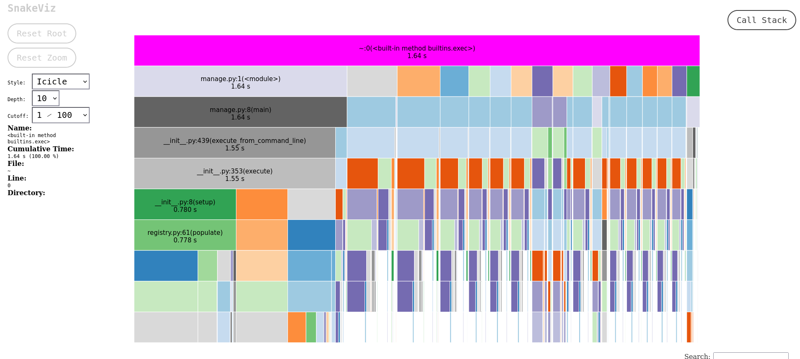

In some situations you don't have the proper APM setup to debug a specific performance problem in your production environment 
or you want a quick feedback loop in order to test some performance improvements without having to go through a release cycle.

In those situations knowing how to debug the performance of your Django application on your localhost can be very useful.
In this article I will show you 4 ways of doing it.


### Using Django Debug Toolbar

This is probably the most frequent way to do it. Django Debug Toolbar will give you some information about what is going
on in your application. I generally use it if I need to know:

- The number and type of SQL queries that were made on a specific page
- The HTML templates that were used
- The time it took to render the response

But Django Debug Toolbar has a lot of limitations:

- It will only work on a page you can load and view in your browser.
This means you won't be able to track the performance of an API you are calling with curl for example.
- You can't track the performance of a script or a Django command
- You don't get a detailed view of the time each operation took.
You can easily find slow queries but won't be able to spot a Python function that took 10ms and was called 100 times on the page.


### Logging all the SQL queries

When I want to focus on the SQL queries I will generally log them in the console using
the following setup in the settings.py file:

```py
LOGGING = {
    "version": 1,
    "filters": {"require_debug_true": {"()": "django.utils.log.RequireDebugTrue",}},
    "handlers": {
        "console": {
            "level": "DEBUG",
            "filters": ["require_debug_true"],
            "class": "logging.StreamHandler",
        }
    },
    "loggers": {"django.db.backends": {"level": "DEBUG", "handlers": ["console"],}},
}
```

The main drawback of this approach is that you will only be able to spot issues with SQL queries but 
it is much more versatile than Django Debug Toolbar:

- You will get full SQL queries that you can then explain using EXPLAIN ANALYZE.
- You can use this method on any type of Django content: classic page, but also an API protected by authentication that you call via cURL or even a Django management command

Most of the time it gives me a good idea of where a query is repeated too many times in a script and could be improved.


### Setting up a mini APM to work with locally

If you want to work on a specific page of your application but that Django debug toolbar does not give you enough details,
then you might want to try this solution.
This is the kind of results we are talking about:



To get this mini local APM working you need to:

- Install pyinstrument: `pip install pyinstrument`
- Add this middleware to a middleware file:
```py

from pyinstrument import Profiler
from django.http import HttpResponse

class PyinstrumentMiddleware:
    def __init__(self, get_response):
        self.get_response = get_response

    def __call__(self, request):
        profiler = Profiler()
        profiler.start()

        response = self.get_response(request)

        profiler.stop()
        print(profiler.output_text(unicode=True, color=True))
        with open(f"profiling/{request.path.replace('/','_')}.html", "w") as f:
            f.write(profiler.output_html())
        return response

```
- Add the middleware to your `MIDDLEWARE` parameter in your settings (at the top of the list)

This can be used in two ways:
- The `print(profiler.output_text(unicode=True, color=True))` line will print you a bunch of information in the console, for each page you visit.
- The file that is created in the profiling directory will give more details

If you ever want to keep all the profiles you could add a timestamp (and maybe the HTTP method?) to the name of the file, I just keep various tabs open in my browser :)

The main benefits of this approach are: 
- The output is very easy to read and can be stored/shared easily
- You can monitor any type of operations: SQL queries, template rendering, external calls, etc.
- It looks nice :)

The main drawback is that it can only be used on requests and would need some adaptation to be used for a management command.


### Monitoring scripts or Django management commands

When I need to monitor any kind of Python script (including management commands)
my go-to tools are cProfile and snakeviz. To do so:

- Install snakeviz: `pip install snakeviz`
- Run your script or command using: `python -m cProfile -o stats.prof script.py`
- Visualize using: `snakeviz stats.prof`

This will give you an HTML page similar to this:




